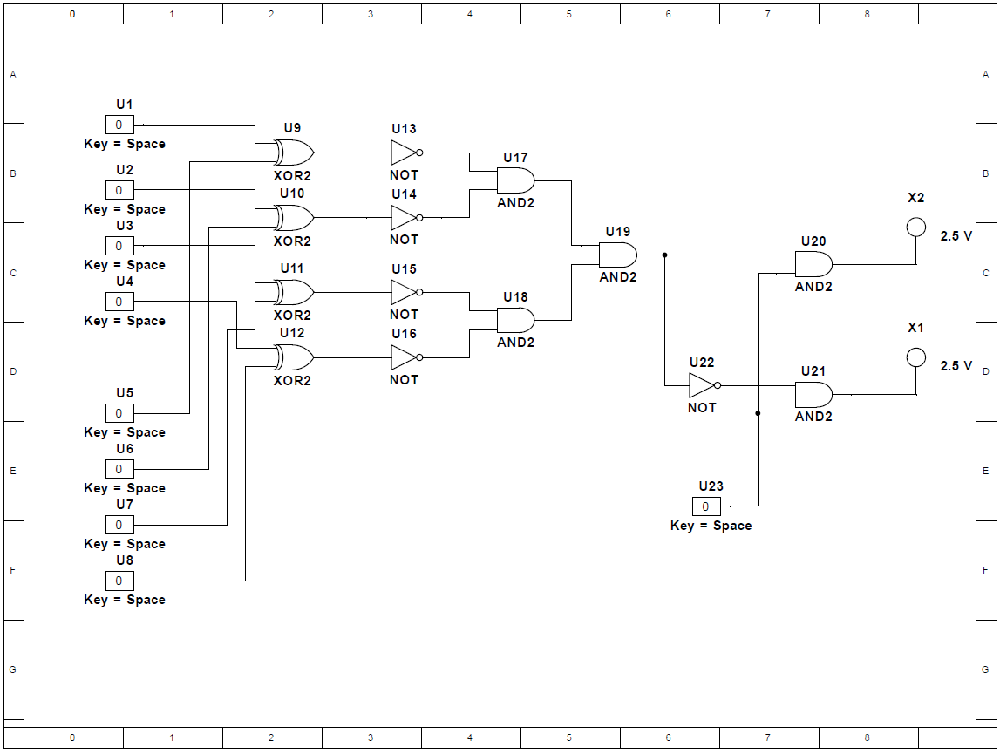
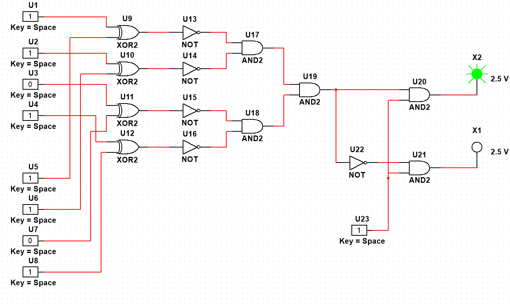

# Password Security System

## Project Overview

This project introduces a 4-bit password security system that utilizes digital logic gates to authenticate user inputs against a stored password. It's designed around the fundamental principles of digital comparison, using XOR, NOT, and AND gates to execute the authentication process efficiently. The system is equipped with two sets of four switches each: one for the stored password and another for user inputs. 

## How It Works

Upon system activation, the user's input password is compared with the stored password through a logical and sequential process:

1. **Comparison**: Each bit of the input password is XORed with the corresponding bit of the stored password via XOR gates. Identical bits result in a zero output, indicating a match at that position.
2. **Inversion**: The outputs of the XOR gates are then fed into a NOT gate, converting zeroes (matches) to ones.
3. **Validation**: These inverted signals are input into an AND gate. If all bits match (all ones after inversion), the AND gate outputs a high signal, lighting up the "valid" indicator bulb or green bulb.
4. **Mismatch Handling**: Any discrepancy between the input and stored passwords results in a non-zero output from the XOR gates, which eventually triggers the "invalid" indicator bulb or the red buln after passing through the logic gate sequence.

## Project Components

- **XOR Gates**: Used for initial comparison of each bit from the input and stored passwords.
- **NOT Gate**: Inverts the output of the XOR gates.
- **AND Gates**: Validates the final comparison result to trigger the appropriate indicator bulb.
- **Switches**: Eight switches in total, divided into two sets for password storage and user input.
- **Indicator Bulbs**: Two bulbs indicating the authentication result - one for a valid match and another for an invalid match.

  
## Circuit

Note that the U23 Switch is toggled off, which renders the system off and no bulb is active.

## Valid Password Circuit

This image demonstrates the circuit configuration when the user enters a valid password, resulting in the activation of the "valid" indicator bulb.

## Invalid Password Circuit

Here is how the circuit behaves when the user enters an invalid password, leading to the lighting of the "invalid" indicator bulb.

## Conclusion

The 4-bit password security system is a practical demonstration of applying basic digital logic to create secure and reliable authentication mechanisms. It showcases how simple digital circuits can be utilized to form an effective binary comparison mechanism, providing clear and immediate feedback on the authentication status through a user-friendly interface. This project not only highlights the utility of digital logic in security systems but also serves as an educational platform for understanding the principles of digital security and logic gates.
